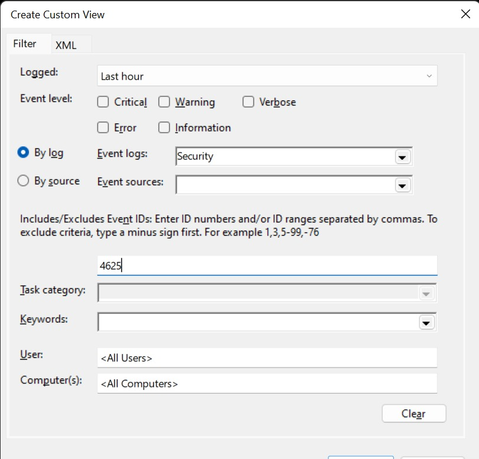
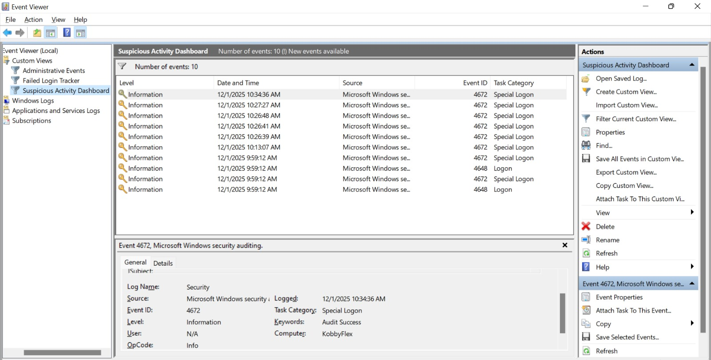

# Windows Security Log Analysis & Threat Hunting

## Project Overview

This project simulates a real-world Blue Team scenario involving the detection of brute force attempts and privilege escalation activity on a Windows endpoint. By intentionally generating malicious events and configuring custom views within Windows Event Viewer, the project demonstrates how to identify key Indicators of Compromise (IoCs) during incident response and threat hunting.

---

## Objectives

* Simulate attacks by generating failed login attempts (Event ID 4625) and unauthorized administrative privilege assignments (Event ID 4672).
* Parse Windows logs to isolate critical security events from general system noise.
* Build persistent custom views in Event Viewer to streamline monitoring and correlation of suspicious events.

---

## Tools and Event IDs

### Tools Used

| Tool                           | Purpose                                        |
| ------------------------------ | ---------------------------------------------- |
| Windows Event Viewer           | Primary log analysis and monitoring interface  |
| Command Prompt (Administrator) | Used to simulate privilege escalation behavior |

### Key Windows Event IDs

| Event ID | Description                                                                              |
| -------- | ---------------------------------------------------------------------------------------- |
| **4625** | Failed login attempts (often associated with brute force attacks)                        |
| **4672** | Special privileges assigned to a new logon session (indicator of privilege escalation)   |
| **4688** | New process creation events (useful for tracing command execution and attacker activity) |

---

## Proof of Concept

### Failed Login Tracker

A custom filter was created to isolate repeated authentication failures and highlight potential brute force activity.

---

### Suspicious Activity Dashboard

A correlated view combining failed login attempts with subsequent high-privilege administrative actions.

---

## Key Takeaways

### Log Noise Reduction

Windows logs generate a significant amount of system noise. Efficient filtering is essential for identifying true security events and reducing analyst workload.

### Importance of Baselining

Understanding normal system and user behavior is critical. Abnormal patterns—such as multiple sequential failed logins followed by an administrative privilege assignment—stand out more clearly when baselines are established.

### Digital Forensics Insight

Nearly every action on a Windows system leaves an audit trace. Even when attackers attempt to clear evidence, certain logs such as Event ID 4688 (process creation) often remain and can be invaluable for forensic analysis.

---

## Attribution

This project was completed as part of the CyberHouse Ghana Sentinels Practical Assignment.

---
